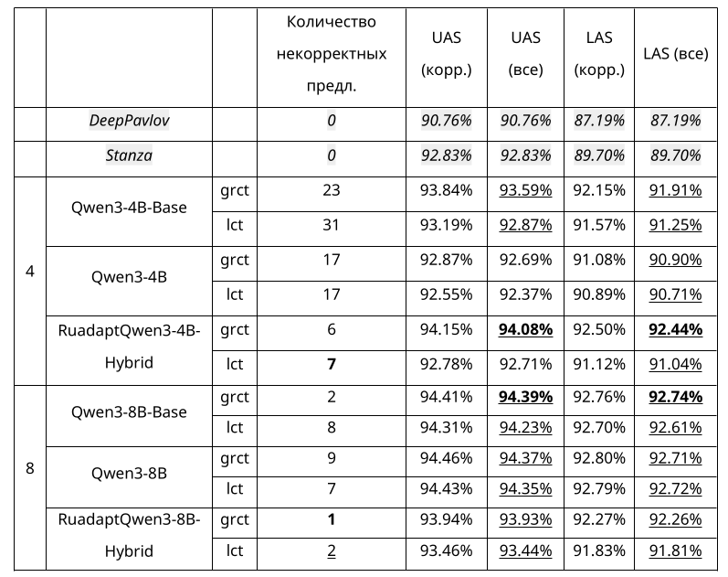

# Дообучение больших языковых моделей для синтаксического анализа русского языка

Цель исследования - проверка возможности дообучения LLM для синтаксического анализа.

Рассматривались:
- LLM базового, инструктивного и адаптированного типа,
- форматы скобочных последовательностей GRCT и LCT.

Для дообучения выбраны модели семейства Qwen3 размером 4 и 8 миллиарда параметров.

Все дообученные LLM превзошли классические нейросетевые синтаксические анализаторы по метрике LAS, и почти все дообученные LLM - по метрике UAS.

Наилучшие дообученные модели опубликованы: https://huggingface.co/collections/Derinhelm/syntaxllm
